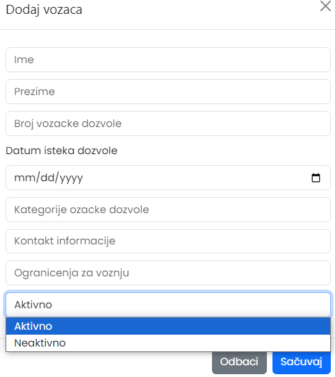
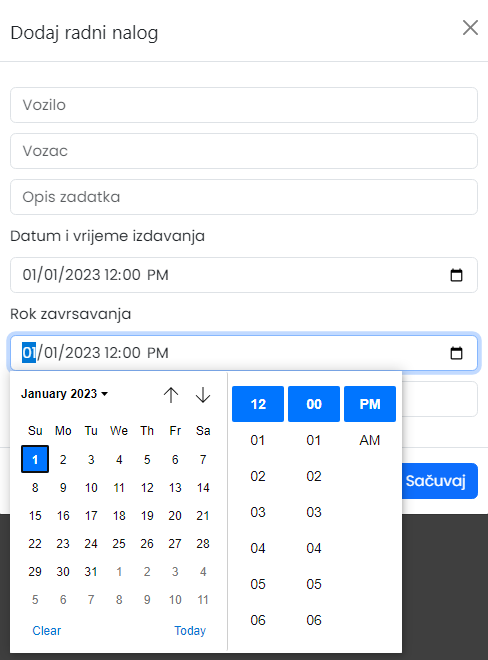

# VozniPark


# UVOD

Projekat “Vozni park” predstavlja sistem evidencije  podataka o vozilima, vozačima i radnim nalozima koji omogućava efikasno vođenje i upravljanje tim podacima. Ovaj sistem je razvijen koristeći Visual Studio Code kao razvojno okruženje, a implementacija se zasniva na kombinaciji više tehnologija, uključujući Python I FastAPI za razvoj backend-a i HTML, CSS i JavaScript za frontend.
Cilj ovog projekta je da pruži jednostavno rješenje za administraciju vozila i vozača, sa mogućnošću generisanja radnih naloga na osnovu dostupnih podataka. U sklopu projekta, korišćene su sledeće tehnologije:
Python i FastAPI: Za razvoj backend-a, FastAPI je korišćen zbog svoje jednostavnosti i mogućnosti izrade API-ja koji efikasno komuniciraju sa bazom podataka. Backend podržava CRUD (Create, Read, Update, Delete) operacije, što omogućava sveobuhvatno upravljanje podacima.
MySQL: Za čuvanje i upravljanje podacima, MySQL baza je korišćena zbog svoje pouzdanosti i široke upotrebe u industriji.
JavaScript, HTML, CSS i Bootstrap: Na frontend strani, ove tehnologije su korišćene za izradu interaktivnog i responzivnog korisničkog interfejsa. Bootstrap je korišćen za brzu izradu funkcionalnih elemenata interfejsa.


# STRUKTURA PROJEKTA

Projekat “Vozni park” organizovan je u nizu fajlova i direktorijuma koji zajedno čine funkcionalnu cjelinu za upravljanje evidencijom vozila, vozača i radnih naloga. Svaki fajl ima specifičnu ulogu u projektu:
* app: Ovaj direktorijum sadrži backend aplikaciju razvijenu koristeći FastAPI framework u Python-u. Sadrži API rute, modele podataka  i logiku aplikacije.
* web: Direktorijum koji sadrži sve fajlove za frontend implementaciju. Ovde se nalaze HTML, CSS i JavaScript fajlovi koji omogućavaju korisnicima interakciju sa backend-om putem web interfejsa.
* .gitignore: Konfiguracioni fajl koji govori Git-u koje datoteke treba da ignoriše. Obično se koristi da se izbjegne urezivanje privremenih datoteka iz vašeg radnog direkrotijuma koje nisu korisne drugim saradnicima. U ovom fajlu je naveden fajl .env u kojem se nalaze podaci za konekciju na bazu (likn i naziv baze, password).
* README: Dokumentacija projekta koja pruža osnovne informacije o projektu..
*	requirements: Fajl koji sadrži listu Python biblioteka potrebnih za izvršavanje aplikacije. Ovo uključuje FastAPI, uvicorn, pydantic i druge zavisnosti.
* sample_data.py: Python skripta koja služi za unošenje podataka u MySQL bazu. Ova skripta pomaže u testiranju aplikacije sa realnim podacima.
* create_usersql: Skripta za kreiranje korisnika u MySQL bazi podataka. Automatizuje proces kreiranja korisničkih naloga u sistemu.
* Docker folderi: Direktorijumi koji sadrže Dockerfile i docker-compose.yml fajlove za konfigurisanje Docker kontejnera. Ovo omogućava laku reprodukciju aplikacije u Docker okruženju.
* .env: Konfiguracioni fajl za virtualno okruženje, koji sadrži važne konfiguracije kao što su putanja do baze podataka i druge podesive parametre.

Ova struktura omogućava jasnu organizaciju i održavanje projekta “Vozni park”, omogućavajući developerima efikasno razvijanje, testiranje i implementaciju novih funkcionalnosti


# BACKEND

Backend u projektu “Vozni park” predstavlja centralni dio aplikacije koji upravlja logikom poslovanja i interakcijom sa bazom podataka. Koristi se Python zajedno sa FastAPI frameworkom za izradu API-ja koji omogućava manipulaciju podacima o vozilima, vozačima i radnim nalozima. Ovaj backend koristi MySQL kao bazu podataka za trajno skladištenje podataka. FastAPI pruža efikasan način za razvoj API-ja, dok Python omogućava jednostavno upravljanje podacima i poslovnom logikom aplikacije.


## STRUKTURA BACKEND-A

Backend se sastoji od nekoliko ključnih komponenti:
1.	API rute
2.	Modeli podataka
3.	Šeme
4.	DB fajl
5.	Main fajl


### API rute
Rute u ovom projektu su definisane tako što se prvo kreira API router (APIRouter()) kako bi se grupisale rute. Zatim se za svaku rutu definiše dekorator (npr. @router.post("/")). Unutar funkcije za rutu, specificira se šta ruta radi i povezuje se sa bazom koristeći db: Session = Depends(get_db). Nakon toga se šalju zahtjevi bazi podataka i dobijaju odgovori. Na kraju, funkcija vraća podatke kao odgovor na zahtev, omogućavajući organizovano i efikasno upravljanje rutama i operacijama nad podacima u bazi.

1. Create-API ruta koja omogućava kreiranje novih zapisa u bazi podataka.

_Ruta za dodavanje novog vozila:_ 
```python
@router.post("/", response_model=VoziloOut)
def create_vozilo(vozilo: VoziloCreate, db: Session = Depends(get_db)):
db_vozilo = Vozilo(**vozilo.dict())
db.add(db_vozilo)
db.commit()
db.refresh(db_vozilo)
return db_vozilo
```

2. Read-API ruta koja omogućava čitanje podataka iz baze. 

_Ruta za dobijanje liste svih vozača ili informacija o jednom vozaču na osnovu njegovog id-a:_

```python
@router.get("/", response_model=List[VozacOut])
def get_vozaci(db: Session = Depends(get_db)):
    vozaci = db.query(Vozac).all()
    if not vozaci:
        raise HTTPException(status_code=404, detail="Nema dostupnih vozača")
    return vozaci

@router.get("/{vozac_id}", response_model=VozacOut)
def get_vozac(vozac_id: int, db: Session = Depends(get_db)):
    vozac = db.query(Vozac).filter(Vozac.id == vozac_id).first()
    if not vozac:
        raise HTTPException(status_code=404, detail="Vozač nije pronađen")
    return vozac
```

3. Update-API ruta koja omogućava ažuriranje postojećih zapisa u bazi podataka.

_Slika 3. Ruta za ažuriranje informacija o radnom nalogu:_

```python
@router.put("/{radni_nalog_id}", response_model=RadniNalogOut)
def update_radni_nalog(radni_nalog_id: int, radni_nalog: RadniNalogCreate, db: Session = Depends(get_db)):
    db_radni_nalog = db.query(RadniNalog).filter(RadniNalog.id == radni_nalog_id).first()
    if not db_radni_nalog:
        raise HTTPException(status_code=404, detail="Radni nalog nije pronađen")
    for key, value in radni_nalog.dict().items():
        setattr(db_radni_nalog, key, value)
    db.commit()
    db.refresh(db_radni_nalog)
    return db_radni_nalog
```

4. Delete-API ruta koja omogućava brisanje zapisa iz baze podataka. 

_Ruta za brisanje vozila:_

```python
@router.delete("/{vozilo_id}")
def delete_vozilo(vozilo_id: int, db: Session = Depends(get_db)):
    db_vozilo = db.query(Vozilo).filter(Vozilo.id == vozilo_id).first()
    if not db_vozilo:
        raise HTTPException(status_code=404, detail="Vozilo nije pronađeno")
    db.delete(db_vozilo)
    db.commit()
    return {"detail": "Vozilo je uspešno obrisano"}
```


### Modeli podataka
 Reprezentuju strukturu podataka koji se koriste u aplikaciji. Na primjer, model za vozača predstavlja klasu koja definiše strukturu tabele “vozaci” u bazi podataka. Ispod tabele definisan je odnos sa modelom “RadniNalog” koji omogućava navigaciju između vozača i njegovih radnih naloga. Varijabla back_populates='vozac' omogućava obostranu vezu između dva modela.

_Model vozača:_

```python
class Vozac(Base):
    __tablename__ = 'vozaci'

    id = Column(Integer, primary_key=True, index=True)
    ime = Column(String(30), index=True)
    prezime = Column(String(30), index=True)
    broj_vozacke_dozvole = Column(String(15), unique=True)
    datum_isteka_dozvole = Column(Date)
    kategorije_vozacke_dozvole = Column(String(15))
    kontakt_informacije = Column(String(100))
    ogranicenja_za_voznju = Column(String(50))
    status = Column(Enum('aktivno', 'neaktivno', name='status_vozaca'), default='aktivno')

    radni_nalozi = relationship('RadniNalog', back_populates='vozac')
```


### Šeme
Šeme za radne naloge definišu strukturu i validaciju podataka pomoću Pydantica. Klase se kreiraju kao naslednici BaseModel iz Pydantica i predstavljaju modele podataka sa atributima i validacionim pravilima. Enumeracija (StatusRadnogNalogaEnum) definiše tri moguća statusa radnog naloga: otvoren, u toku, i završen. Ovo osigurava da atribut statusa može imati samo dozvoljene vrijednosti. Bazična klasa (RadniNalogBase) sadrži osnovne atribute radnog naloga, uključujući ID vozila i vozača, opis zadatka, datum i vreme izdavanja, rok završavanja i status.
Klasa za kreiranje (RadniNalogCreate) nasleđuje bazičnu klasu i koristi se za validaciju prilikom kreiranja novih radnih naloga. Klasa za izlazne podatke (RadniNalogOut) dodaje dodatni atribut id i koristi se za povratne podatke prema klijentu. Ova struktura omogućava striktno definisanje i validaciju podataka, čineći aplikaciju sigurnijom i pouzdanijom.

_Šema radnog naloga:_

```python
class StatusRadnogNalogaEnum(str, Enum):
    otvoren = 'otvoren'
    u_toku = 'u toku'
    zavrsen = 'zavrsen'

class RadniNalogBase(BaseModel):
    vozilo_id: int
    vozac_id: int
    opis_zadatka: str
    datum_i_vrijeme_izdavanja: datetime
    rok_zavrsavanja: datetime
    status: StatusRadnogNalogaEnum

class RadniNalogCreate(RadniNalogBase):
    pass

class RadniNalogOut(RadniNalogBase):
    id: int
    
    class Config:
       from_attributes = True
```


### DB fajl
Ovaj kod konfiguriše vezu sa MySQL bazom podataka koristeći SQLAlchemy i čita vrijednosti iz .env fajla za postavljanje parametara baze. Prvo se učitavaju vrijednosti iz .env fajla, uključujući URL baze podataka. Zatim se kreira engine koji povezuje SQLAlchemy sa bazom podataka.
SessionLocal je konfigurisan za kreiranje sesija sa bazom, sa opcijama autocommit=False i autoflush=False za ručno upravljanje transakcijama i osvježavanjem podataka.
Base je deklarativna baza klasa iz koje će sve SQLAlchemy klase modela naslijediti.
Funkcija get_db definiše zavisnost koja upravlja životnim ciklusom sesije baze podataka, otvarajući sesiju prije operacija sa bazom i zatvarajući je nakon završetka operacija.
 
_Sesija:_

```python
from sqlalchemy import create_engine
from sqlalchemy.orm import sessionmaker
from sqlalchemy.ext.declarative import declarative_base
from dotenv import load_dotenv
import os

load_dotenv(dotenv_path=os.path.join(os.path.dirname(__file__), '.env'))

MYSQL_ROOT_PASSWORD = os.getenv("MYSQL_ROOT_PASSWORD")
MYSQL_DATABASE = os.getenv("MYSQL_DATABASE")

DATABASE_URL = os.getenv("DATABASE_URL")


engine = create_engine(DATABASE_URL)
SessionLocal = sessionmaker(autocommit=False, autoflush=False, bind=engine)

Base = declarative_base()

# Dependency
def get_db():
    db = SessionLocal()
    try:
        yield db
    finally:
        db.close()
```


### Main fajl
Ovaj fajl definiše osnovnu konfiguraciju FastAPI aplikacije. Kreira se FastAPI instanca sa prilagođenim URL-ovima za dokumentaciju i dodaje se CORS middleware koji omogućava zahtjeve sa svih origin-a. Funkcija startup_event inicijalizuje bazu podataka pri pokretanju aplikacije pozivom init_db(). Definiše se jednostavna root ruta koja vraća "Hello, World", a sve definisane API rute uključene su pomoću app.include_router (api_router). 

_Main fajl:_

```python
from fastapi import FastAPI
from db import init_db
from api.routes import api_router
from fastapi.middleware.cors import CORSMiddleware


app = FastAPI(docs_url="/api/docs/", openapi_url="/api/openapi.json")

origins = ["*"]

app.add_middleware(
    CORSMiddleware,
    allow_origins=origins,
    allow_credentials=True,
    allow_methods=["*"],
    allow_headers=["*"],
)


@app.on_event("startup")
def startup_event():
    init_db()  # Inicijalizujte bazu podataka kada aplikacija počne sa radom

@app.get("/api/")
def read_root():
    return {"Hello": "World"}


app.include_router(api_router)
```


# FRONTEND

Frontend je razvijen koristeći kombinaciju tehnologija kao što su HTML, JavaScript (JS) i CSS. HTML se koristi za strukturu i organizaciju sadržaja stranica, dok se JavaScript koristi za dinamičko ažuriranje sadržaja i interakciju sa korisnikom bez osvježavanja stranice.


## STRUKTURA FRONTEDA

Frontend aplikacija sadrži sledeće komponente:
1.	HTML fajlovi
2.	JS fajlovi
3.	CSS - Stilizacija elemenata na stranici za bolje korisničko iskustvo.


### HTML fajlovi
Interfejs je organizovan kao jednostranična aplikacija sa bočnom navigacijom koja omogućava brzo prebacivanje između dijelova aplikacije. Glavni dio sadrži tabelu sa podacima vozila (vozača, radnih naloga), uključujući osnovne njihove informacije. Takođe, sadrži dugme za dodavanje novog vozila (vozača, radnih naloga) koje otvara modalni prozor za unos novih podataka. Modalni prozor za unos podataka takođe sadrži formu sa poljima za unos informacija o vozilu (vozača, radnih naloga), kao i polja za odabir tipa goriva i statusa. Dodatno, postoji modalni prozor za j vozila sa sličnom strukturom, omogućavajući ažuriranje postojećih podataka. JavaScript fajl app.js je uključen radi implementacije funkcionalnosti kao što su dodavanje i ažuriranje vozila.


_Primjer html koda za kreiranje tabele koja prikazuje podatke o vozilima:_

```html
 <table class="table">
                <thead>
                    <tr>
                        <th scope="col">R.br.</th>
                        <th scope="col">Marka</th>
                        <th scope="col">Model</th>
                        <th scope="col">Reg.</th>
                        <th scope="col">Istek reg.</th>
                        <th scope="col">Godište</th>
                        <th scope="col">Gorivo</th>
                        <th scope="col">Status</th>
                        <th scope="col">Izmjeni</th>
                        <th scope="col">Izbriši</th>
                    </tr>
                </thead>
                <tbody id="tableBody">

                </tbody>
            </table>
```

_Izgled tabele koja prikazuje podatke o vozilima u pretraživaču:_


_Primjer html koda modala za dodavanje novog vozača:_

```html
 <div class="modal-body">
                            <!-- <input type="text" class="form-control" placeholder="id" aria-label="id" id="id"> -->
                            <input type="text" class="form-control" placeholder="Ime" aria-label="Ime" id="ime">
                            <input type="text" class="form-control" placeholder="Prezime" aria-label="Username" id="prezime">
                            <input type="text" class="form-control" placeholder="Broj vozacke dozvole" aria-label="Username" id="broj_vozacke_dozvole">
                            <input type="date" class="form-control" placeholder="Datum isteka dozvole" aria-label="Username" id="datum_isteka_dozvole">
                            <input type="text" class="form-control" placeholder="Kategorije ozacke dozvole" aria-label="Username" id="kategorije_vozacke_dozvole">
                            <input type="text" class="form-control" placeholder="Kontakt informacije" aria-label="Username" id="kontakt_informacije">
                            <input type="text" class="form-control" placeholder="Ogranicenja za voznju" aria-label="Username" id="ogranicenja_za_voznju">
                            <select class="form-control" id="status">
                                <option value="aktivno">Aktivno</option>
                                <option value="neaktivno">Neaktivno</option>
                            </select>  
                            <p id="greskaUpisa"></p>
                        </div>
```

_Izgled modala za dodavanje vozača u pretraživaču:_



Implementirali smo u modale combo box za odabir statusa i vrste goriva (u slučaju vozila). Ove kontrole osiguravaju da korisnici mogu birati samo iz predefinisanih opcija, čime se smanjuje mogućnost grešaka prilikom unosa podataka.

_Primjer html koda za kreiranje combo box-a:_

```html
<select class="form-control" id="gorivo">
                                <option value="dizel">Dizel</option>
                                <option value="benzin">Benzin</option>
                                <option value="plin">Plin</option>
                            </select>
                            <br>
                            <select class="form-control" id="status">
                                <option value="dostupno">Dostupno</option>
                                <option value="u servisu">U servisu</option>
                                <option value="rezervisano">Rezervisano</option>
                            </select>
```

Takođe, implementirani su i date pickeri za vozače i vozila, dok su za radne naloge uvedeni date-time pickeri, što olakšava unos tačnih vremena i datuma.

_Primjer html koda za kreiranje datetime picker-a:_

```html
 <form>
                                <label for="datum_i_vrijeme_izdavanja">Datum i vrijeme izdavanja</label>
                                <input type="datetime-local" value="2023-01-01T12:00" class="form-control"
                                    placeholder="Datum i vrijeme izdavanja" aria-label="Username"
                                    id="datum_i_vrijeme_izdavanja">
                            </form>
                            <form>
                                <label for="rok_zavrsavanja">Rok zavrsavanja</label>
                                <input type="datetime-local" value="2023-01-01T12:00" class="form-control"
                                    placeholder="Rok zavrsavanja" aria-label="Username" id="rok_zavrsavanja">
                            </form>
```
 
_Izgled datetime picker-a u pretraživaču:_




### JavaScript fajlovi
U našoj aplikaciji, JavaScript fajlovi sadrže funkcije koje obavljaju osnovne CRUD operacije (kreiranje, čitanje, ažuriranje, brisanje) i omogućavaju otvaranje modala za dodavanje i izmjenu podataka. Ove funkcije su implementirane na sledeći način:
* Fetch Podaci: Svaka funkcija za komunikaciju sa backendom koristi fetch API kako bi slala i primala podatke sa servera.
* Get:  Funkcija getVozila koristi fetch za dohvat podataka sa servera (GET metoda). Nakon uspješnog dobijanja podataka, tabela se popunjava podacima.
* Insert: Funkcija insertVozilo koristi fetch za slanje podataka na server (POST metoda). Podaci se šalju u JSON formatu, a prije slanja provjerava se da li su sva polja popunjena.
* Update: Funkcija updateVozilo koristi fetch za ažuriranje podataka na serveru (PUT metoda). Kao i kod unosa, podaci se šalju u JSON formatu i provjerava se da li su sva polja popunjena.
* Delete: Funkcija deleteVozilo koristi fetch za brisanje podataka sa servera (DELETE metoda).
* Error Handling: Svaka fetch operacija uključuje try-catch blokove kako bi se hvatale i prikazivale greške. Ako dođe do greške prilikom komunikacije sa serverom, prikazuje se odgovarajuća poruka.
* Modali: Funkcije openUpdateModal i clearInputFields koriste Bootstrap modal za prikaz i unos podataka. Funkcija openUpdateModal otvara modal i popunjava ga podacima odabranog entiteta, dok clearInputFields čisti input polja nakon zatvaranja modala.
* Validacija: Prije slanja podataka na server, provjerava se da li su sva obavezna polja popunjena. Ako neko polje nije popunjeno, baca se greška i prikazuje odgovarajuća poruka korisniku.
Ovaj pristup osigurava da podaci budu pravilno poslani i primljeni sa servera, te da korisnici imaju intuitivno iskustvo prilikom korišćenja aplikacije.
 
_Primjer js funkcije za izmjenu postojećeg vozila:_

 ```js
 const updateVozilo = async () => {


    // kreiramo veliki objekat koji šaljemo na server
    const vozilo = {
        // isti nazivi atributa kao na backendu
        marka: document.getElementById("markaUpdate").value,
        model: document.getElementById("modelUpdate").value,
        registracijski_broj: document.getElementById("registracijaUpdate").value,
        datum_isteka_registracije: document.getElementById("datumRegistracijeUpdate").value,
        godina_proizvodnje: document.getElementById("godisteUpdate").value,
        tip_goriva: document.getElementById("gorivoUpdate").value,
        status: document.getElementById("statusUpdate").value
    }

    try {
        for (let voziloAtribut in vozilo) {
            // for petlja prolazi kroz svaki atribut objekta vozilo
            // if provjerava da li je polje prazno
            if (!vozilo[voziloAtribut]) {
                throw new Error("Nisu popunjena sva polja!")
            }
        }
        // pokušavamo da pošaljemo podatke na server i izmjenimo u bazi pomoću fetcha
        const response = await fetch(`http://127.0.0.1:8000/api/vozila/${idSelektovanogVozila}`, {
            method: "PUT", // metoda put je za update podataka 
            body: JSON.stringify(vozilo), // u body ide objekat koji šaljemo apiju tj vozilo
            headers: {
                "Content-type": "application/json" // tip podatka
            }
        })

        if (!response.ok) { // provjeravamo da li nije izmjenjen podatak u bazu
            throw new Error("Podaci nisu imjenjeni u bazi!") // ako nije bacamo grešku

        }

        location.reload()  
        
    } catch (err) { // hvatamo grešku
        document.getElementById("greskaUpisaUpdate").innerHTML = err?.message
    }
}
 ```

_Primjer js funkcije koja čisti input polja:_

```js
const clearInputFields = () => {
    // ova funkcija čisti input polja, odnosno briše dosadašnji input
    document.getElementById("marka").value = ""
    document.getElementById("model").value = ""
    document.getElementById("registracija").value = ""
    document.getElementById("datumRegistracije").value = ""
    document.getElementById("godiste").value = ""
    document.getElementById("gorivo").value = ""
    document.getElementById("status").value = ""
}

var myModalEl = document.getElementById('exampleModalLabel') // selektujemo insert modal
myModalEl.addEventListener('hidden.bs.modal', function (event) {
    // na zatvaranje insert modala pokrećemo clear inputs funkciju koja čisti input polja
    clearInputFields()
    // kod ispod uklana i prikaz greške kod validacije
    document.getElementById("greskaUpisa").innerHTML = null
})
```
 
_Primjer js funkcije za čitanje radnih naloga:_

```js
async function getRadniNalog() {
    // popunjavanje tabele

    // selektuje table body iz html-a
    let tableBody = document.getElementById("tableBody")
    tableBody.innerHTML = null // čisti tabelu prije popunjavanja 

    try {
        // kreiramo red u tabeli
        let row
        const response = await fetch(`http://127.0.0.1:8000/api/radni-nalozi/`)
        const data = await response.json() // niz svih vozila iz baze

        data.forEach((radni_nalog) => {
            row = `
            <tr>
                <td>${radni_nalog?.id}</td>
                <td>${radni_nalog?.vozilo_id}</td>
                <td>${radni_nalog?.vozac_id}</td>
                <td>${radni_nalog?.opis_zadatka}</td>
                <td>${radni_nalog?.datum_i_vrijeme_izdavanja}</td>
                <td>${radni_nalog?.rok_zavrsavanja}</td>
                <td>${radni_nalog?.status}</td>
                <td><svg xmlns="http://www.w3.org/2000/svg" width="16" height="16" fill="currentColor"
                        class="bi bi-pencil" 
                        viewBox="0 0 16 16"
                        onClick="openUpdateModal(${radni_nalog?.id})"
                        >
                        <path
                            d="M12.146.146a.5.5 0 0 1 .708 0l3 3a.5.5 0 0 1 0 .708l-10 10a.5.5 0 0 1-.168.11l-5 2a.5.5 0 0 1-.65-.65l2-5a.5.5 0 0 1 .11-.168zM11.207 2.5 13.5 4.793 14.793 3.5 12.5 1.207zm1.586 3L10.5 3.207 4 9.707V10h.5a.5.5 0 0 1 .5.5v.5h.5a.5.5 0 0 1 .5.5v.5h.293zm-9.761 5.175-.106.106-1.528 3.821 3.821-1.528.106-.106A.5.5 0 0 1 5 12.5V12h-.5a.5.5 0 0 1-.5-.5V11h-.5a.5.5 0 0 1-.468-.325" />
                    </svg></td>
                <td>
                    <div class="action-button" onClick="deleteRadniNalog(${radni_nalog?.id})">
                        <svg xmlns="http://www.w3.org/2000/svg" width="16" height="16" fill="currentColor"
                            class="bi bi-trash" viewBox="0 0 16 16">
                            <path
                                d="M5.5 5.5A.5.5 0 0 1 6 6v6a.5.5 0 0 1-1 0V6a.5.5 0 0 1 .5-.5m2.5 0a.5.5 0 0 1 .5.5v6a.5.5 0 0 1-1 0V6a.5.5 0 0 1 .5-.5m3 .5a.5.5 0 0 0-1 0v6a.5.5 0 0 0 1 0z" />
                            <path
                                d="M14.5 3a1 1 0 0 1-1 1H13v9a2 2 0 0 1-2 2H5a2 2 0 0 1-2-2V4h-.5a1 1 0 0 1-1-1V2a1 1 0 0 1 1-1H6a1 1 0 0 1 1-1h2a1 1 0 0 1 1 1h3.5a1 1 0 0 1 1 1zM4.118 4 4 4.059V13a1 1 0 0 0 1 1h6a1 1 0 0 0 1-1V4.059L11.882 4zM2.5 3h11V2h-11z" />
                        </svg>
                    </div>
                </td>
            </tr>
            `
            tableBody.innerHTML += row

        })
        

    } catch (err) {
        tableBody.innerHTML = `<tr>Desila se greška!</tr>`
    }
}
```


# BAZA PODATAKA

MySQL je popularni relacioni sistem upravljanja bazama podataka koji omogućava efikasno upravljanje podacima putem SQL upita.
 
_Struktura baze podataka:_


U projektu “Vozni Park”, veza sa bazom podataka ostvaruje se kroz .env fajl koji sadrži potrebne informacije kao što su link do baze, korisničko ime i lozinka. Ove informacije se koriste za uspostavljanje veze sa bazom podataka tokom sesije. U sesiji se kreira funkcija get_db koja omogućava API rutama da pristupaju bazi podataka. Za potrebe frontend dijela aplikacije, postoji constants.js fajl u kojem je definisan base_url koji se koristi u JavaScript funkcijama za komunikaciju sa backend-om putem API-ja. Ovaj pristup omogućava efikasnu i sigurnu komunikaciju između frontend-a i backend-a u projektu “Vozni Park”.


# DOCKER INTEGRACIJA

Docker je alat za kontejnerizaciju koji omogućava pakovanje i izvršavanje aplikacija u izolovanim okruženjima zvanim kontejnerima. U projektu “Vozni Park”, koristimo Docker za upravljanje backend, frontend i nginx servisima. docker-compose.yaml fajl definiše kako se ovi servisi pokreću i povezuju, dok se Dockerfile-backend, Dockerfile-frontend i Dockerfile-nginx koriste za konfiguraciju svakog pojedinačnog servisa. Ovo omogućava konzistentno razvojno okruženje i jednostavan deployment aplikacije, što doprinosi efikasnijem razvoju i upravljanju infrastrukturom projekta.


# ZAKLJUČAK

U ovom seminarskom radu smo istražili razvoj aplikacije “Vozni Park” kroz implementaciju backend, frontend i Docker infrastrukture. Korišćenjem odgovarajućih tehnologija za manipulaciju podacima o vozilima, vozačima i generisanje radnih naloga, omogućili smo efikasno upravljanje evidencijom. Implementirali smo osnovne operacije za manipulaciju podacima, a testiranje je potvrdilo ispravnost i kvalitet koda. Kroz ovaj projekat, stekli smo dragoceno iskustvo u primeni savremenih tehnologija za razvoj softvera.

